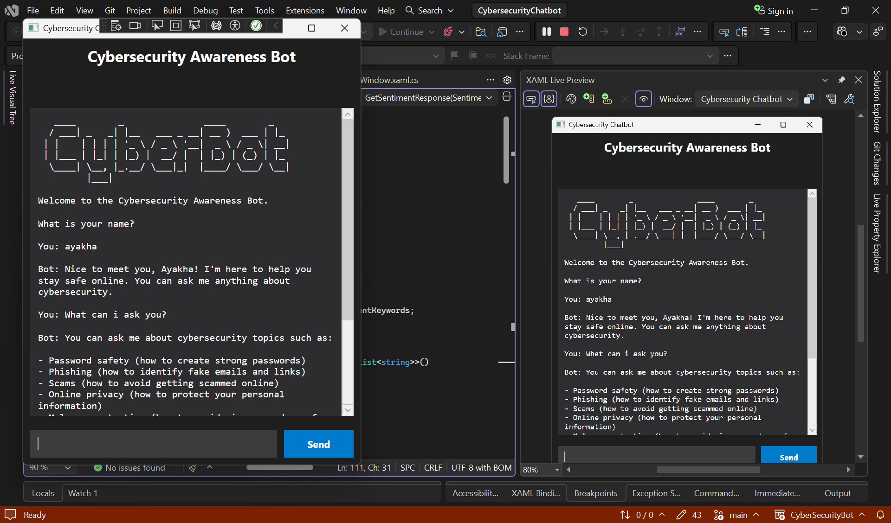
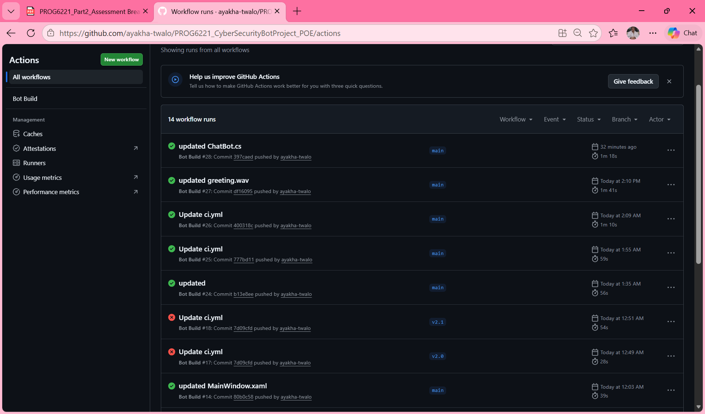
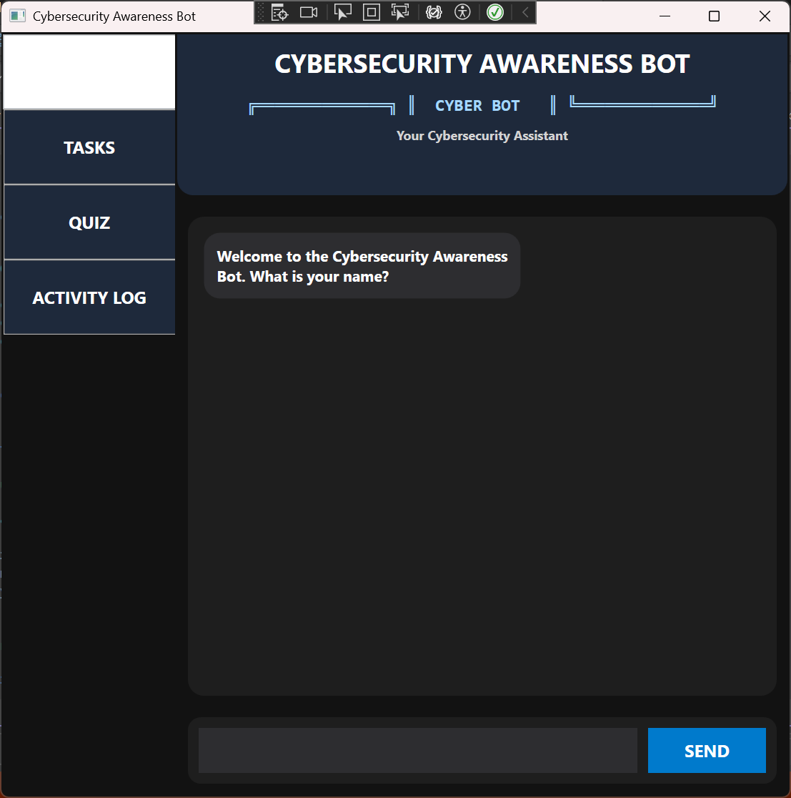
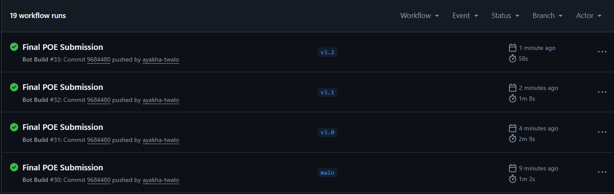

# Cybersecurity Awareness Chatbot

A C# WPF chatbot application that helps users learn about cybersecurity topics such as phishing, password safety, malware protection, and safe browsing.

---

## Student Information

- Name: Ayakha Twalo  
- Student Number: ST10490430  
- Module: Programming  
- Module Code: PROG6221  

---

## Project Overview

The Cybersecurity Awareness Chatbot is a desktop application built using C# and WPF in Visual Studio 2022. The chatbot interacts with users through a graphical user interface and provides cybersecurity awareness tips using keyword recognition, sentiment detection, memory features, and personalised responses.

The application was developed as part of the PROG6221 Programming module.

---

## Features Implemented in Part 2

### GUI Features
- WPF graphical user interface
- User input textbox
- Chat display area
- Send button for interaction

### Cybersecurity Features
- Password safety tips
- Phishing awareness guidance
- Malware protection advice
- Safe browsing recommendations

### Advanced Features
- Voice greeting using WAV audio
- Personalised greeting with user name
- Sentiment detection:
  - Worried
  - Curious
  - Frustrated
  - Happy
- Memory system:
  - Stores user name
  - Stores favourite cybersecurity topic
- Follow-up responses such as:
  - “Tell me more”
  - “Explain further”
- Randomised chatbot responses for more natural interaction

### Programming Concepts Used
- Object-Oriented Programming (OOP)
- Classes and methods
- Dictionaries and lists
- Exception handling
- File handling
- Event-driven programming in WPF

---

## Technologies Used

- C#
- WPF (Windows Presentation Foundation)
- .NET 8.0
- Visual Studio 2022

---

## Prerequisites

Before running the project, make sure you have:

- Windows Operating System
- Visual Studio 2022
- .NET 8.0 SDK installed

---

## How to Clone and Run the Project

### Step 1: Clone the Repository

Open GitHub Desktop or Git Bash and run:

https://github.com/ayakha-twalo/PROG6221_CyberSecurityBotProject_POE

### Step 2: Open the Project

- Open Visual Studio 2022
- Click **Open a Project or Solution**
- Select the `.sln` file

### Step 3: Restore Dependencies

Visual Studio should automatically restore packages.

If needed:
- Go to **Tools → NuGet Package Manager → Restore Packages**

### Step 4: Build the Project

- Press `Ctrl + Shift + B`
- Ensure the build succeeds without errors

### Step 5: Run the Application

- Press `F5`
or
- Click the green **Start** button

The chatbot window should open successfully.

---

## Audio File Setup

For the voice greeting to work correctly:

- Place the `greeting.wav` file inside the project directory
- Ensure the file is included in the project in Visual Studio
- Set the file properties to:
  - **Build Action:** Content
  - **Copy to Output Directory:** Copy if newer

---

## Application Screenshots

### Main GUI

---

## GitHub Actions Build Status

---

## YouTube Presentation Video

https://youtu.be/VPbCCZRxPAM

---

## Project Timeline and Milestones

- 28 March 2026: Created project structure 
- 2 April 2026: Added personalised greeting 
- 3 April 2026: Implemented keyword detection 
- 5 April 2026: Added validation and default responses 
- 6 April 2026: Improved interface formatting 
- 7 April 2026: Added voice greeting 
- 10 April 2026: Completed Part 1 testing 
- 24 May 2026: Upgraded to WPF 
- 25 May 2026: Added GUI, memory, and sentiment detection 

## Features Implemented in Part 3

### Step 3.1: Install Newtonsoft.Json

If the package is not automatically restored:

1. Right-click the project in Solution Explorer
2. Select **Manage NuGet Packages**
3. Click **Browse**
4. Search for **Newtonsoft.Json**
5. Click **Install**
6. Accept the license agreement if prompted

## Task Storage

The application stores cybersecurity tasks using a JSON file named `tasks.json`.

* No manual setup is required.
* The file is automatically created when the first task is added.
* Tasks remain saved between application sessions.

## Task Assistant
- Add cybersecurity-related tasks
- Store task title, description, and reminder information
- Mark tasks as completed
- Delete tasks
- View all saved tasks
- Task data persistence using JSON file storage (tasks.json)

## Reminder System
- Users can create reminders for cybersecurity tasks
- Reminder information is stored with each task
- Reminder actions are recorded in the activity log

## Cybersecurity Quiz
- 15 cybersecurity awareness questions
- Multiple-choice question format
- Immediate feedback after each answer
- Score tracking throughout the quiz
- Skip question functionality
- Final score summary displayed at completion

## Natural Language Processing (NLP) Simulation

The chatbot recognises user intent through keyword detection and string matching.

Supported intents include:

- Add Task
- Set Reminder
- Start Quiz
- Show Activity Log

Example supported commands:

"Add a task to enable 2FA"
"Remind me to update my password in 2 days"
"Quiz me"
"Start quiz"
"Show activity log"
"What have you done for me?"

## Activity Log
- Records important chatbot actions
- Logs task creation
- Logs task completion
- Logs task deletion
- Logs reminder creation
- Logs quiz activity
- Displays the most recent actions
- Supports viewing the complete activity history

## Additional Programming Concepts Used
- JSON data storage and retrieval
- Activity tracking and logging
- NLP simulation using string manipulation
- Task management systems
- Interactive quiz systems
- Advanced WPF event handling

## Releases

### Release 1 - Part 1

Initial cybersecurity awareness chatbot featuring:

* Keyword recognition
* Cybersecurity guidance
* Input validation
* Console-based interaction

### Release 2 - Part 2

Enhanced chatbot featuring:

* WPF graphical user interface
* Sentiment detection
* User memory system
* Audio greeting
* Personalised responses

### Release 3 - Part 3

Final chatbot release featuring:

* Task Assistant
* Reminder System
* Activity Log
* Cybersecurity Quiz
* NLP Simulation
* JSON task storage

## Application Screenshots

---

## GitHub Actions Build Status

---

## YouTube Presentation Video

https://youtu.be/TJT8DM4LoeU

## References

- Microsoft Learn. (2025). C# Documentation  
  https://learn.microsoft.com/

- W3Schools. (2025). C# Tutorial  
  https://www.w3schools.com/cs/

---

## Author

Ayakha Twalo  
ST10490430
